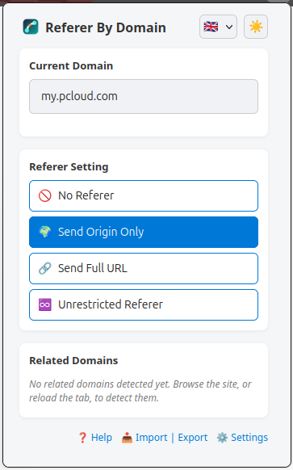
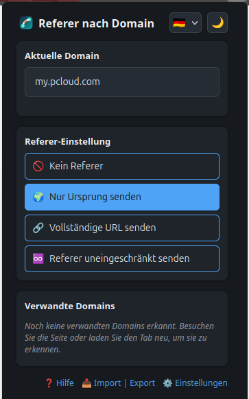
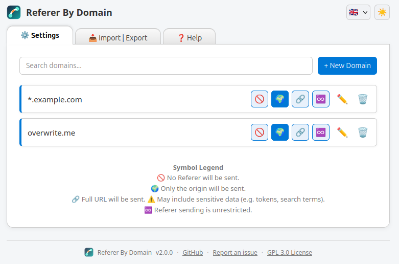
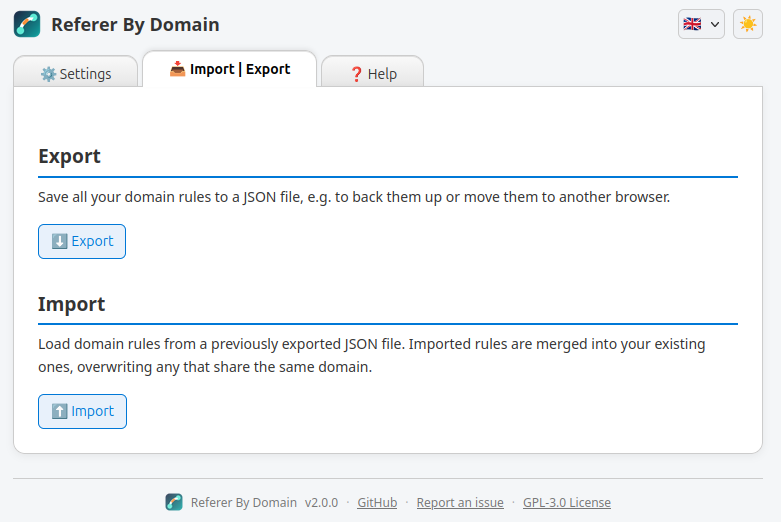
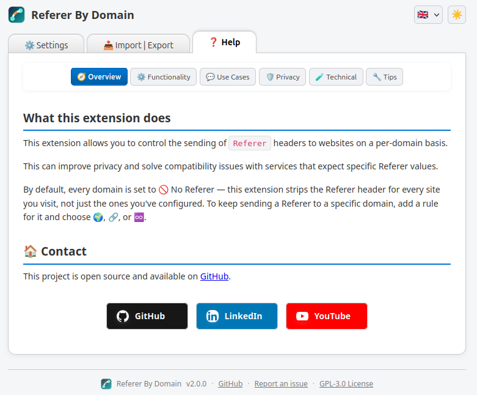
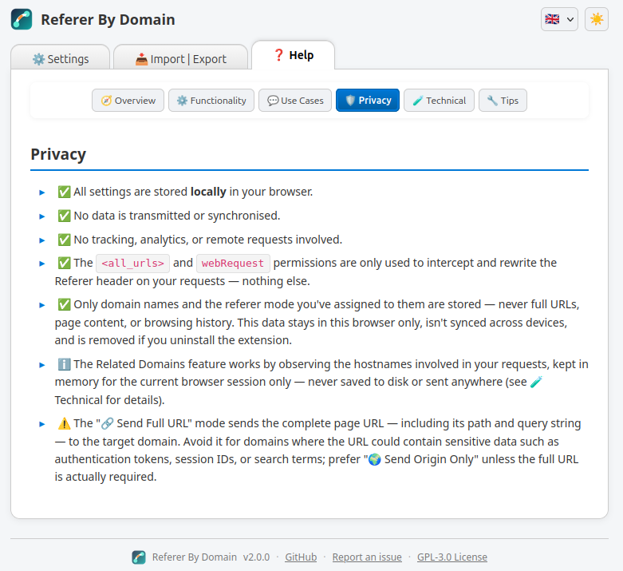

# Referer By Domain

**Referer By Domain** is a Firefox extension that allows users to control the `Referer` header on a per-domain basis.  
It simulates the behaviour of `network.http.sendRefererHeader`, but with fine-grained control.

---

## ✨ Features

- 🌐 Set different `Referer` policies depending on the visited domain
- 🧩 Wildcard support (e.g. `*.example.com`)
- 🔄 Automatically detects **related domains** used by each site (e.g. APIs, CDNs), persisted across background worker restarts
- ✏️ Rename domains and reload detection from the popup
- 🌍 Localised in 🇬🇧 English, 🇩🇪 German, 🇫🇷 French, 🇵🇱 Polish, 🇯🇵 Japanese, 🇪🇸 Spanish, 🇵🇹 Portuguese, 🇨🇿 Czech and 🇸🇰 Slovak, with a manual language override and an "auto" mode that follows the browser
- 🌗 Light/dark/auto theme, applied consistently across the popup and options pages
- 🗔 Themed modal dialogs for adding, editing, deleting, and importing domains
- 📘 Built-in help section with tabbed overview
- 🎯 Choose between no Referer, only origin, full URL, or unrestricted
- 📤 Export/import settings as JSON, to back them up or move them to another browser
- ⚡ Lightweight and privacy-focused

---

## 📸 Screenshots

| Popup (light) | Popup (dark) |
|:---:|:---:|
|  |  |

| Settings | Import / Export |
|:---:|:---:|
|  |  |

| Help — Overview | Help — Privacy |
|:---:|:---:|
|  |  |

---

## ⚙️ Referer Modes

The options page lets you configure Referer behaviour for any domain:

| Mode | Value | Behaviour |
|:----:|:-----:|:----------|
| 🚫   | 0     | Do not send a Referer |
| 🏠   | 1     | Send only the origin (e.g. `https://example.com`) |
| 🌎   | 2     | Send the full URL |
| ♾️   | 3     | Send Referer without restrictions |

Wildcard rules (e.g. `*.example.com`) apply to all matching subdomains.

---

## 🔍 Related Domains

When a website loads resources from other domains (like `api.example.com`),  
those related domains are automatically detected and displayed in the popup.  
You can configure them just like the main domain.

Use this to fix login flows, media delivery, or API calls that depend on Referer headers.

---

## 🧪 Running Tests

This project uses [Jest](https://jestjs.io/) and [Babel](https://babeljs.io/) to run unit tests.

```bash
npm install
npm test
```

###  Test Structure

`test/*.test.js`: Unit tests for core logic (`src/*/*.js`).

### Development
`test/testserver/`: Simple Express server for manual header testing.

```bash
npm run start-server
```

Open `http://localhost:3000/Test.html` and fire your requests.

---

## 🌍 Translations

English and German are maintained directly; the remaining languages are AI-translated and may contain errors. A dismissible notice points this out in the UI when one of those languages is active.

---

## 🤝 Contributing

Feedback, bug reports and pull requests are welcome.
Feel free to open an <a href="https://github.com/transfairs/referer-by-domain/issues">issue or contribute directly.

---

## 📜 License

This project is open-source and licensed under the **GNU General Public License v3.0**. See the [LICENSE](LICENSE) file for details.
